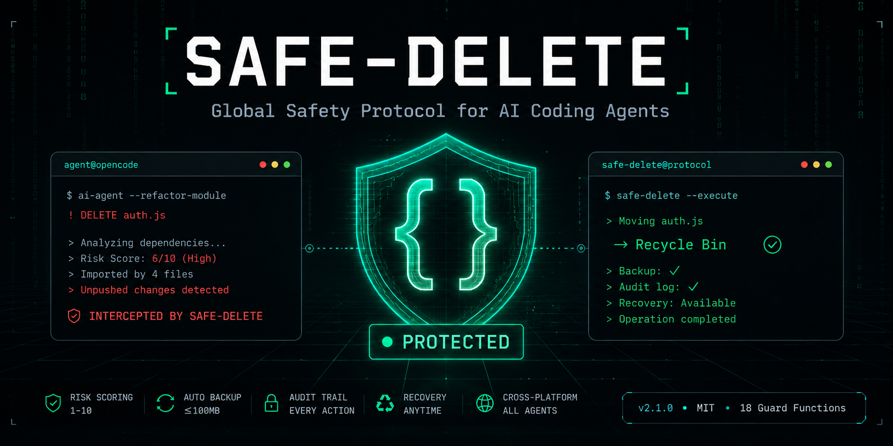
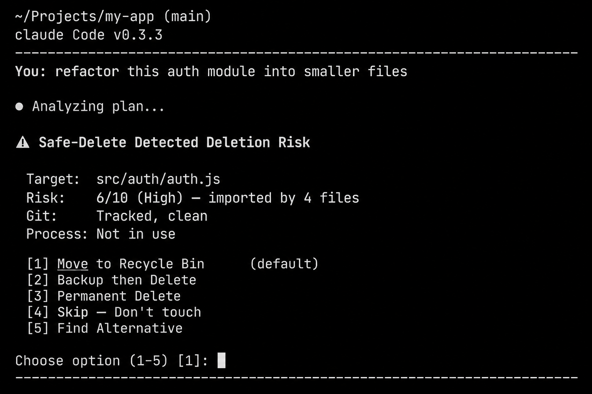

# Safe-Delete 🛡️

**Global safety protocol for AI coding agents. Prevents catastrophic data loss during automated refactoring, cleanup, migration, and deployment tasks.**

[](version.json)
[](LICENSE)
[](PLATFORMS.md)
[](USAGE.md#compatibility)

<p align="center">
  
</p>

---

## Why Safe-Delete?

AI coding agents are powerful — but they don't know your files the way you do. During a refactor, an agent might:

- **Delete the only copy** of a database export
- **Remove an old config file** that's still referenced by a running service
- **Clean up `node_modules`** that contains locally patched packages
- **Overwrite `.env.production`** thinking it's a leftover

Safe-Delete sits between the agent and every delete operation. It scores risk, checks dependencies, offers alternatives, creates backups, and audits everything — all with a clean, user-friendly modal.

**It works on every major AI coding platform** — OpenCode, Claude Code, Cursor, Codex, Copilot CLI, Gemini CLI, and any agentic terminal.

---

## Quick Start

### 1. Install

```bash
# Clone and run the installer
git clone https://github.com/YOUR_USER/safe-delete.git
cd safe-delete
./install.sh

# Or one-liner (no clone needed)
curl -fsSL https://raw.githubusercontent.com/YOUR_USER/safe-delete/main/install.sh | bash
```

### 2. Enable in your project

Add to your agent's config file:

```yaml
# AGENTS.md / CLAUDE.md / GEMINI.md / .cursorrules
safe_delete: on
```

### 3. That's it

Safe-Delete activates automatically:
- Before **any delete** during coding, refactoring, or cleanup
- When you type `/safe-delete` to check status
- As a background watcher during complex tasks

---

## Features

### Core Safety

| Feature | Description |
|---------|-------------|
| **Always-Bound** | Activates during ALL agent tasks, not just when "delete" is mentioned |
| **Risk Scoring** | 1–10 auto-score based on file type, size, age, context, and modifiers |
| **Delete Modal** | 5 options every time: Recycle Bin, Backup+Delete, Permanent, Skip, Alternative |
| **Automated Backup** | ≤100MB auto-backup; >100MB ask before backup |
| **Secret Safekeeper** | Invisible 48h backup in AppData — survives Recycle Bin empty |
| **Audit Trail** | Every deletion logged with timestamp, path, risk, and outcome |
| **Sub-Agent Watcher** | Background monitor that intercepts all deletes during task execution |

### Slash Commands

| Command | Effect |
|---------|--------|
| `/safe-delete` | Show current status |
| `/safe-delete on` | Full protection (default) |
| `/safe-delete off` | Trigger-only mode |
| `/safe-delete watcher` | Deploy background watcher |
| `/safe-delete status` | Extended status + recent activity |
| `/safe-delete uninstall` | Triple-confirm self-destruct + terminal UNINSTALLED state |

### Production Safeguards (v2.1)

| Feature | What It Prevents |
|---------|-----------------|
| **CI/CD Detection** | Accidental deletions in headless CI pipelines |
| **Git-Aware Protection** | Deletion of unpushed commits or dirty worktrees |
| **Process-Aware Deletion** | Removal of files open by running processes |
| **Language-Aware Guard** | Import graph analysis before deleting source files |
| **Integrity Guard** | Protection of entry points, config files, and migration histories |
| **Graphify Awareness** | Dependency graph integration with credit estimation and install modal |
| **Skill Integration Gate** | Meta-orchestration across graphify, claude-memory-kit, CodeFlow, and sibling skills |
| **Lockfile Integrity** | Package manager manifest + lockfile guard for `node_modules/`, `vendor/`, `packages/` |
| **Symlink Guard** | Symlink/hardlink/junction detection — distinguishes link vs target deletion |
| **Cloud Sync Guard** | OneDrive/Dropbox/iCloud/Google Drive detection with multi-device sync warnings |

### Cross-Platform

| Platform | Status |
|----------|--------|
| Windows (PowerShell) | ✅ Full support |
| macOS (Zsh/Bash) | ✅ Full support |
| Linux (Bash) | ✅ Full support |
| OpenCode | ✅ Native |
| Claude Code | ✅ Native |
| Cursor | ✅ Chat/Composer |
| Codex/VS Code | ✅ Agent mode |
| Copilot CLI | ✅ Terminal |
| Gemini CLI | ✅ Native |

---

## Architecture

```
┌─────────────────────────────────────────────────────────┐
│                    SKILL.md                              │
│           Entry point — always loaded                    │
├─────────────────────────────────────────────────────────┤
│                                                         │
│  ┌──────────────┐    ┌──────────────────┐               │
│  │ commands.md   │    │ behaviour.md     │               │
│  │ /safe-delete  │◄──►│ triggers, states,│               │
│  │ on/off/watcher│    │ decision flow    │               │
│  └──────────────┘    └────────┬─────────┘               │
│                               │                         │
│                               ▼                         │
│  ┌────────────────────────────────────────────────┐     │
│  │            FUNCTIONS LAYER                      │     │
│  │                                                  │     │
│  │  fn-risk-scoring       fn-delete-modal           │     │
│  │  fn-delete-methods     fn-backup                │     │
│  │  fn-audit              fn-database              │     │
│  │  fn-permanent-delete   fn-emergency             │     │
│  │  fn-recovery           fn-safekeeper            │     │
│  │  fn-instant-mode       fn-environment           │     │
│  │  fn-ci-cd              fn-git-aware             │     │
│  │  fn-process-aware      fn-language-aware        │     │
│  │  fn-integrity-guard    fn-graphify-awareness    │     │
│  │  fn-skill-integration  fn-lockfile-integrity    │     │
│  │  fn-symlink-guard      fn-cloud-sync            │     │
│  └────────────────────────────────────────────────┘     │
│                               │                         │
│                               ▼                         │
│  ┌────────────────────────────────────────────────┐     │
│  │          EXECUTION LAYER                        │     │
│  │  Recycle Bin  │  Backup  │  Permanent  │  Skip  │     │
│  └────────────────────────────────────────────────┘     │
│                               │                         │
│                               ▼                         │
│  ┌────────────────────────────────────────────────┐     │
│  │          PERSISTENCE LAYER                      │     │
│  │  Audit Log  │  Safekeeper  │  Backup Store      │     │
│  │  Deletion Diary  │  Recovery Scripts           │     │
│  └────────────────────────────────────────────────┘     │
└─────────────────────────────────────────────────────────┘
```

---

## Usage Example

```bash
# You ask your agent to refactor a module
User: "Split auth.js into smaller modules"

# Agent detects the plan involves deleting auth.js
Agent: "This task requires:
   - Create auth-login.js       (new)
   - Create auth-signup.js      (new)
   - Create auth-middleware.js  (new)
   - Delete auth.js             ⚠

  Deploy background deletion watcher? [Yes/No]"

# You say Yes — watcher intercepts the delete
# Presents the modal automatically
┌─────────────────────────────────────────────┐
│ ⚠ DELETE CONFIRMATION                      │
│ Target:  src/auth/auth.js                   │
│ Risk:    6/10 (High) — imported by 4 files  │
│                                             │
│ [1] Move to Recycle Bin        (default)    │
│ [2] Backup then Delete                      │
│ [3] Permanent Delete                        │
│ [4] Skip — Don't touch                     │
│ [5] Find Alternative                        │
└─────────────────────────────────────────────┘

# You choose [1] — Recycle Bin
# File is safely moved, can be restored any time
```

---

## Demo

<p align="center">
  
  <br>
  <em>Safe-Delete modal in action during a Claude Code session</em>
</p>

---

## Installation Methods

### Method 1: Clone + Install
```bash
git clone https://github.com/YOUR_USER/safe-delete.git
cd safe-delete
./install.sh
```

### Method 2: Remote One-Liner
```bash
curl -fsSL https://raw.githubusercontent.com/YOUR_USER/safe-delete/main/install.sh | bash
```

### Method 3: Manual
```bash
# Copy the safe-delete directory to your agent's skills folder
cp -r safe-delete ~/.config/opencode/skills/
# Or for Claude Code:
cp -r safe-delete ~/.claude/skills/
```

### Method 4: Project-Local
```bash
./install.sh --local    # ./.opencode/skills/
./install.sh --project  # ./.opencode/
```

---

## Configuration

```bash
# Environment variable (overrides all config)
export SAFE_DELETE=on     # Full protection (default)
export SAFE_DELETE=off    # Trigger-only
export SAFE_DELETE=watcher  # Auto-watcher at start

# Disable safekeeper (not recommended)
export SAFEKEEPER_ENABLED=false
```

```yaml
# AGENTS.md / CLAUDE.md / GEMINI.md / .cursorrules
safe_delete: on
safekeeper_enabled: true  # default: true
```

---

## Compatibility

### AI Platforms

| Platform | Installation Path | Config File |
|----------|-----------------|-------------|
| OpenCode | `~/.config/opencode/skills/` | `AGENTS.md` |
| Claude Code | `~/.claude/skills/` | `CLAUDE.md` |
| Cursor | `.cursor/skills/` | `.cursorrules` |
| Codex | `~/.codex/skills/` | `CODEX.md` |
| Copilot CLI | `~/.config/github-copilot/skills/` | `.github/copilot-instructions.md` |
| Gemini CLI | `~/.config/gemini/skills/` | `GEMINI.md` |

### Storage Locations

| Data | Location | TTL |
|------|----------|-----|
| Audit log | `~/.opencode-trash/deletion-log.txt` | Permanent |
| Backups | `~/.opencode-trash/` | User-managed |
| Safekeeper | `%LOCALAPPDATA%/.opencode-safekeeper/` (Win) / `~/.local/share/opencode-safekeeper/` (Unix) | 48h |

---

## Project Structure

```
safe-delete/
├── SKILL.md                    # Skill entry point — always-loaded protocol
├── behaviour.md                # Agent behaviour, triggers, decision flow
├── commands.md                 # /safe-delete slash commands
├── functions/
│   ├── fn-delete-methods.md    # 5 delete operation types
│   ├── fn-risk-scoring.md      # Auto risk scoring (1–10)
│   ├── fn-delete-modal.md      # Interactive 5-option modal
│   ├── fn-backup.md            # Backup & restore (≤100MB auto, >100MB ask)
│   ├── fn-audit.md             # Audit logging & deletion diary
│   ├── fn-database.md          # Database safety (SQL preview, transaction)
│   ├── fn-permanent-delete.md  # Guarded permanent deletion
│   ├── fn-environment.md       # Dev/staging/prod detection
│   ├── fn-emergency.md         # Emergency abort + rollback
│   ├── fn-recovery.md          # Recovery from all sources
│   ├── fn-safekeeper.md        # Secret 48h backup layer
│   ├── fn-instant-mode.md      # Conscious fast delete
│   ├── fn-ci-cd.md             # CI/CD pipeline safety
│   ├── fn-git-aware.md         # Git-aware protection
│   ├── fn-process-aware.md     # Process-aware deletion
│   ├── fn-language-aware.md    # Language-aware import guards
│   ├── fn-integrity-guard.md   # Project integrity checks
│   ├── fn-graphify-awareness.md   # Dependency graph integration
│   ├── fn-skill-integration.md    # Meta-skill orchestration
│   ├── fn-lockfile-integrity.md   # Package manager lockfile guard
│   ├── fn-symlink-guard.md        # Symlink/hardlink/junction safety
│   └── fn-cloud-sync.md           # Cloud sync detection
├── references/
│   └── cheatsheet.md           # Quick reference
├── docs/
│   ├── ARCHITECTURE.md         # System architecture
│   ├── DESIGN-DECISIONS.md     # Design rationale
│   ├── PLATFORMS.md            # Platform-specific setup
│   └── USAGE.md                # Detailed usage guide
├── examples/
│   ├── coding-refactor.md      # Refactoring walkthrough
│   ├── deployment-cleanup.md   # Deployment cleanup walkthrough
│   └── database-migration.md   # Database migration walkthrough
├── scripts/
│   ├── install.sh              # Cross-platform installer
│   ├── validate.sh             # Structure validator
│   └── test-prereqs.sh         # Prerequisite checker
├── tests/
│   ├── test-scenarios.md       # Manual test scenarios
│   ├── test-skill-structure.sh # File layout tests
│   ├── test-risk-scoring.ps1   # PowerShell risk scoring tests
│   └── test-risk-scoring.sh    # Bash risk scoring tests
├── .github/
│   ├── workflows/ci.yml        # CI pipeline
│   ├── ISSUE_TEMPLATE/         # Issue templates
│   └── PULL_REQUEST_TEMPLATE.md
├── README.md                   # This file
├── LICENSE                     # MIT
├── CONTRIBUTING.md             # How to contribute
├── CHANGELOG.md                # Version history
├── version.json                # Semantic version
└── Makefile                    # Common tasks
```

---

## License

MIT — use these skills in your projects, teams, and tools.

---

## Contributing

See [CONTRIBUTING.md](CONTRIBUTING.md) for guidelines. All contributions welcome — bug reports, feature requests, documentation improvements, and new safeguards.

---

*Built by Bence. Inspired by addyosmani/agent-skills and anthropics/skills.*
